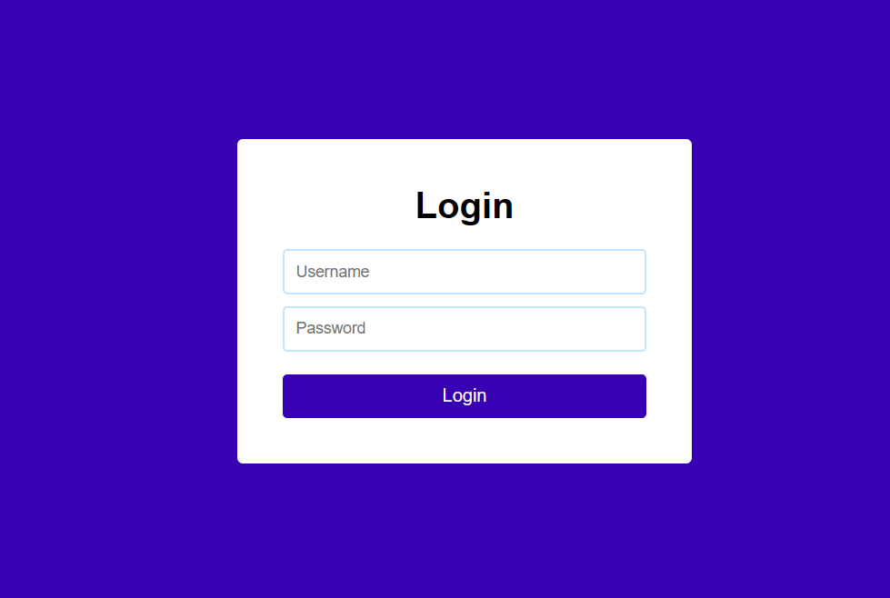

# React Login App with Flask API

This project is a simple login application built using React for the frontend and Flask API with Python for the backend. It allows users to input their username and password, sends the credentials to the backend server for authentication, and displays a success or failure message based on the response from the server.

## Features

- User-friendly login interface
- Real-time validation for username and password fields
- Feedback messages for successful or failed login attempts
- Integration with Flask API for backend authentication

## Prerequisites

Before running the application, make sure you have the following installed on your system:

- Node.js and npm (for React frontend)
- Python (for Flask backend)
- Flask and Flask-CORS (for setting up the API)

## Getting Started

### Frontend (React)

1. Clone this repository to your local machine:

   git clone https://github.com/ms-maheswari/Python-Assessment

2. Navigate to the `react-login-app` directory:
   
   cd react-login-app

3. Install dependencies using npm:

   npm install

4. Start the React development server:

   npm start

This will run the frontend application at `http://localhost:3000`.

### Backend (Flask API)

1. Install Flask and Flask-CORS:

   pip install flask flask-cors

2. Start the Flask server:
   
   python app.py

   This will run the Flask API server at `http://localhost:5000`.

## Usage

   Once both frontend and backend servers are running, you can access the application at `http://localhost:3000` in your web browser. Enter your username and password, and click the "Login" button to submit the credentials. The application will display a success message if the login is successful, or an error message if the login fails.

This is the output of the login page

If the login is failed

!(Screenshots/2.png)

If the login is success

!(Screenshots/3.png)